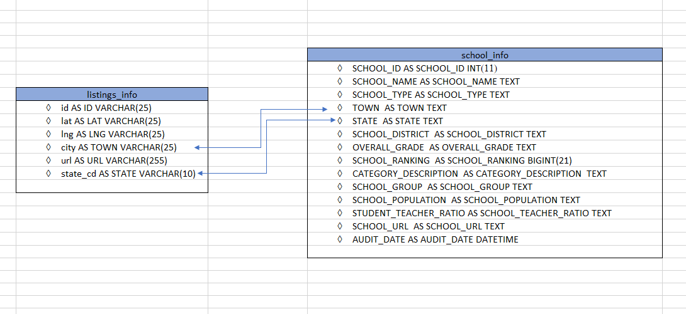

# Rutgers 2019 Data Engineering and Visualization ETL Project 

## Quick Summary 

We provide an ETL pipeline that enables parents or realtors helping parents with school age children, who are looking to identify good public-school districts and are sensitive to high home prices. This ETL pipeline allows for analysis of median home prices and school ranking and come up with an optimal township / city school based on a predefined median house price combination. Based on the median house price range, a list of highest ranked schools, are provided across NJ.

## Steps to run the pipeline: 

First, ensure the following are in place at the same level as ‘Niche_Scraper.py’
	‘Resources’  directory 
	‘states.csv’ within the ‘Resources’ Directory 
	Create_DB.sql is in the same directory ‘Niche_Scraper.py’
	‘load_schools_data.sql’ in the same directory as ‘Niche_Scraper.py’
	‘chromedriver.exe’ in the same directory as ‘Niche_Scraper.py’
	
	
Install all the required pip installs / python libraries using ‘requirements.txt’ 

	

Then proceed through following steps

1. In the terminal,  export MYSQL_PWD="TYPE YOUR PASSWORD HERE";

2.  Run the following python scripts in sequence 

o	python zillow_all_states.py

o	python Niche_Scraper.py

3. Final sql to find top ranked High Schools with Listings for Median Household prices between $300,000  and  $500,000.

1.	Open MYSQL Workbench, and run the following SQL 

SELECT LISTING.*, SCHOOL.*
FROM REALTOR_DB.ZILLOW_LISTING LISTING
INNER JOIN REALTOR_DB.SCHOOL_INFO  SCHOOL
ON SCHOOL.TOWN = LISTING.CITY
AND LISTING.STATE_CD = 'NJ'
AND CATEGORY_DESCRIPTION = 'HIGH'
AND MEDIAN_PRICE > 299999
AND MEDIAN_PRICE < 500001
ORDER BY SCHOOL_RANKING;

4. Make sure templates directory has 
	index.html and 
	css.style.

  Make sure 
o	Get_Details.py and 
o	app.py are both in same directory as templates 
o	Kick off app.py 

	by running below -

•	python app.py

5. Go to chrome and visit http://127.0.0.1:5000/
  Type in your favorite NJ town to find the schools and listings.
     ex: SUMMIT, UNION, MILLBURN, EDISON

## Narrative / Motivation

Important considerations for families with school age children, when purchasing a house especially when they relocate, is the affordability of the house and the quality of education in the school districts. Even though good information exits online, about school districts and their ranking, rarely is this information along with available housing easily available across the state in a standardized and consistent manner to do comparative analysis.

We are helping parents or Realtors (serving parents) to help make decisions to find suitable city/town/district to settle by identifying a list of top ranked public schools at the Elementary/ Middle, High School level, based on their housing affordability.

Our Use Case is to help parents with school age children, who are looking to relocate their homes into areas where they can get the best schools, with suitable housing costs.

## Final Schema / Data Model 

 

Data Model looks at two tables listing_info and school_info. A join at the 'TOWN' AND 'STATE' allows for building a relationship between the housing and school and related information. 

## Data Sources

Two data sources were extracted. 

1.	Niche.com - School ranking information from ‘Niche.com’ was scraped along with location (city, district…) and  other related information using Niche_Scraper.py.
	This script will create 2 csv files – 	
o	niche_school_info_all.csv & 
o	niche_school_info_all_nj.csv 	 into Resources folder.

2.	Zillow.com – Housing information was extracted to identify available homes for sale  at the city  level. 

The above data sets reflect the best of content available in the marketplace for identifying the ranking of public schools at a state level (Niche.com) and Zillow.com provides the best and most comprehensive and up to date data of available homes for sales at an aggregated level,   and hence were sourced.

Assumptions:
•	Parents with school age children have a fairly good idea about the homes prices (range) they are able to afford.
•	Parents with school age children are looking for either a ‘Public’ elementary or middle or high school
•	All other factors, size of homes, age of homes, other factors – distance to work (if applicable) are all assumed to not have as significant impact as the first two (home price and school ranking)

## Transformation Step

Explain how you got your raw data into the final model. 
What were the specific steps you had to take to get the data into the final data model. 

Raw data scrapped from the Niche.com site was transformed significantly, and the following steps were involved.

1. Cleansing using Python 

We grouped the education level of schools across three categories - E = Elementary, M = Middle School and H = High School.
We stripped all ‘Private School’s’ and ‘online’ schools from the data set.
We are limiting the data collection to ‘NJ’ state (had to cleanse other states which appeared) 
Parsed NAN  ‘State’,  and ‘district’ information using information from URL 

2. Cleansing Using SQL

Grading was standardized – we removed the ‘Overall Niche’ Grade 
e.g.  Before - A Overall Niche Grade
cleaned - A 

Removed ‘Students’ from the ‘Overall Number of student fields’
e.g. Before - 500 overall number of students
After/Cleaned - 500

3. Added rank to schools in the order in which they are listed in niche.com

Using a Join to match Schools to Median Housing Price Information.
Assigned Rank based on the sequence of listing.

## APP Development 

A web application was created to allow for searches by Town.

This would list the highest ranked school for each school type  and Listings for the town.

Url is provided via the app for further analysis.

### Team: 	
Mark Reilly, Renju Zacharia, Sanjeev Mankar, Abdul Razak
